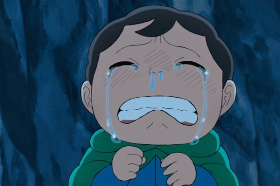

<!DOCTYPE html>
<html>

<head>
    <meta charset="utf-8">
    <title>My test page</title>
    <link href="styles/style.css" rel="stylesheet" type="text/css">
    <link href="https://fonts.googleapis.com/css2?family=Noto+Sans+TC:wght@300&family=Roboto:ital,wght@1,100&display=swap" rel="stylesheet">
</head>

<body>
    <h1>國王排名</h1>
    <h2>主角介紹</h2>
    
    
我的名字叫<strong><a href="https://zh.wikipedia.org/wiki/%E5%9C%8B%E7%8E%8B%E6%8E%92%E5%90%8D">波吉</a></strong>，我的優點有以下

    <ol>
        <li>堅強</li>
        <li>勇敢</li>
        <li>開朗</li>
    </ol>

    
等等 ... 

    
伯斯王的長子。德斯帕的徒弟。 波吉是伯斯王和第一任的巨人妻子所生，所以波吉種族上是純種巨人，因此胃比一般人強健，擁有極高抗毒性。 然而因伯斯王年輕時和魔神訂下契約，為了讓伯斯王獲得天下無雙的武力，而奪走波吉原有的巨人之力，導致波吉一出生就極為矮小，且又聾又啞，也完全沒有任何「膂力」（意指：力量）。 個性容易害羞和沒自信，但是見到他人有難時總是不顧一切想要上前幫忙，擁有一顆溫柔且不輕言放棄的心。因身材矮小和無法聽說的緣故，被國民嘲笑，雖然波吉總是笑臉迎人，但私底下仍會因此落淚。 即使完全沒有力量，但是波吉擁有高超的迴避能力，而且在接受德斯帕的修行之後學會如何針對弱點下手，絕招是利用細劍針對弱點使他人暈眩和破壞物體。
        依照德斯帕所說，波吉基本無人能敵，甚至連冥府之王德斯哈都可打敗，唯一的剋星是不死之身歐肯。
    

    <button>Change user</button>
    
</body>

</html>
